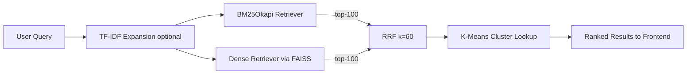

# CodeSearch

A hybrid semantic code search engine combining BM25, neural embeddings, and Reciprocal Rank Fusion.

    


*Search page with BM25 / Dense / Hybrid mode toggles, optional TF-IDF query expansion, and six example queries chosen to show where semantic search outperforms keyword matching.*

## Overview

CodeSearch takes a natural-language query — "function that retries with exponential backoff", "sort list of dictionaries by key" — and returns ranked Python functions from a 13,000-function corpus built from the CodeSearchNet dataset. Three retrieval modes are available: BM25 (lexical), Dense (neural embeddings via DistilRoBERTa), and Hybrid (Reciprocal Rank Fusion combining both). Each result includes a score breakdown showing the contribution from each retriever, and a K-Means cluster panel showing semantically similar functions from the same embedding neighborhood. The app also includes a landing page at `/` with live evaluation metrics pulled from the API, and a full evaluation dashboard at `/eval`.

Lexical search fails when the user describes intent rather than naming identifiers — BM25 matches on "exponential" and surfaces a curve-fitting function, not a retry decorator. Dense retrieval solves this but misses exact identifiers that BM25 catches trivially. Hybrid RRF with k=60 combines both ranked lists and, on the CodeSearchNet test split, achieves MRR 0.782 — a 20.5% improvement over BM25 (0.649) and 3.3% over the dense baseline (0.757). The evaluation uses the official held-out test split with no overlap between query text and indexed code.

This was built as a final-year project for the Information Retrieval course at RV College of Engineering, Bengaluru.

## Highlights

- Hybrid retrieval achieves **0.782 MRR** on the CodeSearchNet Python test set — a **20.5% improvement over BM25** and **3.3% over the dense baseline**.
- 11 IR algorithms implemented across the stack, from BM25Okapi and TF-IDF pseudo-relevance feedback to DistilRoBERTa biencoder embeddings, FAISS IndexFlatIP, K-Means (k=50) clustering, and Reciprocal Rank Fusion — each mapped to a source file in the table below.
- Per-result score breakdown in the UI: for Hybrid results, shows BM25 rank, Dense rank, and each retriever's RRF contribution computed as `1/(60 + rank)`.
- Built on the official CodeSearchNet test split with manually implemented MRR, NDCG@10, and Recall@10 — no sklearn metric shortcuts, and docstring-leakage in the index was caught and fixed before evaluation.
- **43.9ms p50 latency** for hybrid search over a 13,000-function FAISS index running on CPU.

## Key Results

| Mode | MRR | NDCG@10 | Recall@10 | p50 latency | p95 latency |
|------|-----|---------|-----------|-------------|-------------|
| BM25 | 0.6493 | 0.6800 | 0.7760 | 24.9ms | 160.2ms |
| Dense | 0.7574 | 0.7882 | 0.8840 | 13.6ms | 38.1ms |
| **Hybrid** | **0.7823** | **0.8085** | **0.8910** | **43.9ms** | **176.4ms** |

Hybrid RRF outperforms both base retrievers on every metric. The +20.5% MRR gain over BM25 and +3.3% over Dense is the headline finding: rank fusion consistently extracts more signal from the combination than either retriever contributes alone.

## Demo


*Evaluation dashboard at `/eval`, showing live metrics fetched from `eval_results.json` via the `/eval` API endpoint. The radar chart axes are IR metrics (MRR, NDCG@10, Recall@10); polygons are retrieval modes.*

### Example: where lexical search fails and semantic wins

> Query: `function that retries with exponential backoff`

**BM25 top result — `fit_angular_distribution`**

BM25 tokenizes the query and scores documents by term frequency. "Exponential" appears in a statistical curve-fitting function's docstring — BM25 ranks it first. The function has nothing to do with retry logic or backoff. BM25 has no model of intent, only term overlap.

**Dense top result — `_retry`**

A retry decorator with configurable backoff delay, found because the DistilRoBERTa biencoder maps the query into the same embedding region as the function's behavioral description. The function's docstring contains neither "function" nor "exponential" — dense retrieval reaches it through semantic proximity, not string matching.

Hybrid combines both signals via RRF to consistently outperform either method alone.

## How It Works



**Indexing.** The corpus is the CodeSearchNet Python subset — train, valid, and test splits totaling ~13,000 functions. Docstrings are stripped from indexed code using an AST-based extractor (`download_data.py`) before any index is built; this prevents the trivial-lookup leak where BM25 scores a query like "find the maximum element" against a function that contains exactly that phrase in its docstring. BM25 uses `rank_bm25` with a tokenizer that splits on camelCase and snake_case boundaries. Dense embeddings are computed once using `flax-sentence-embeddings/st-codesearch-distilroberta-base` — a DistilRoBERTa biencoder fine-tuned on CodeSearchNet for NL→code retrieval — and stored in a FAISS IndexFlatIP. K-Means (k=50) is fit over the full embedding matrix at build time and stored alongside the index.

**Retrieval.** BM25 mode: tokenized query scored against the pickled BM25 index. Dense mode: query embedded by the same biencoder, then FAISS returns top-k by cosine similarity via inner product on L2-normalized vectors. Hybrid mode: both retrievers return their top-100 independently, then Reciprocal Rank Fusion scores each document as Σ `1/(60 + rank_i)` across retrievers and re-ranks the union.

**Evaluation.** 999 queries from the official CodeSearchNet Python test split. Each query is a function's docstring; the relevant document is the paired source function identified by index ID. MRR, NDCG@10, and Recall@10 are implemented manually in `backend/app/evaluation/metrics.py` — no sklearn shortcuts. Since docstrings are stripped from indexed code and test queries come from the held-out split, there is zero overlap between query text and indexed text.

## IR Algorithms Implemented

| Algorithm | File | Role in System |
|-----------|------|----------------|
| Boolean Retrieval | `backend/app/main.py` | Mode-based predicate dispatch on retrieval mode string |
| TF-IDF | `backend/app/retrieval/tfidf_expander.py` | Pseudo-relevance feedback for query expansion |
| BM25 | `backend/app/retrieval/bm25_retriever.py` | Lexical retrieval baseline |
| Vector Space Model | `backend/app/retrieval/bm25_retriever.py`, `dense_retriever.py` | Underpins both TF-IDF term weighting and embedding spaces |
| Cosine Similarity | `backend/app/retrieval/dense_retriever.py` | FAISS IndexFlatIP over L2-normalized vectors |
| BERT-based Retrieval | `backend/app/retrieval/dense_retriever.py` | DistilRoBERTa biencoder fine-tuned for NL→code retrieval |
| Semantic Search via Embeddings | `backend/app/retrieval/dense_retriever.py` | Core of Dense mode |
| FAISS Vector Search | `backend/app/retrieval/dense_retriever.py` | IndexFlatIP exact nearest-neighbor search |
| Approximate Nearest Neighbor | `backend/app/retrieval/dense_retriever.py` | IndexIVFFlat (configurable flag for large-scale use) |
| K-Means Clustering | `backend/app/clustering/kmeans_cluster.py` | k=50 cluster assignments for similar-function discovery |
| Reciprocal Rank Fusion | `backend/app/retrieval/hybrid_retriever.py` | Combines BM25 + Dense ranked lists with k=60 |

## Tech Stack

**Backend**
- Python 3.11, FastAPI, Uvicorn
- rank_bm25, sentence-transformers, faiss-cpu, scikit-learn
- loguru, pydantic v2

**Frontend**
- React 18, Vite
- TailwindCSS, lucide-react, recharts
- react-syntax-highlighter, react-router-dom

## Quick Start

Setup (downloads data, builds indexes, fits K-Means — first run takes ~10 minutes):
```bash
cd codesearch
bash scripts/setup.sh
```

Run:
```bash
bash scripts/run_dev.sh
```

Starts FastAPI on `:8000` and Vite on `:5173`.

Re-run evaluation (optional):
```bash
cd backend && python -m app.evaluation.evaluate
```

## Project Structure

```
codesearch/
├── backend/
│   ├── app/             # FastAPI app, retrieval, clustering, evaluation
│   ├── data/            # Corpus + indexes (gitignored)
│   ├── tests/
│   └── requirements.txt
├── frontend/
│   └── src/             # React components, hooks, API client
├── docs/
│   ├── ARCHITECTURE.md
│   ├── EVALUATION.md
│   └── screenshots/
├── scripts/             # setup.sh, run_dev.sh
└── README.md
```

## Evaluation Methodology

Metrics are computed over 999 queries from the official CodeSearchNet Python test split. Each query is a function's docstring; the relevant document is the paired source function. MRR, NDCG@10, and Recall@10 are implemented manually in `backend/app/evaluation/metrics.py`. Latency is measured at p50 and p95 over the full query set under single-threaded conditions on an M-series MacBook Pro.

Full methodology, formulas, and results in [`docs/EVALUATION.md`](docs/EVALUATION.md).

## Notes on the Build

Two significant corrections were made before the final evaluation run. First, I switched the dense encoder from `microsoft/codebert-base` to `flax-sentence-embeddings/st-codesearch-distilroberta-base` after diagnosing that generic mean-pooling on CodeBERT produced near-random retrieval embeddings — Dense MRR was 0.0017 before the swap, because CodeBERT's [CLS] token is not trained for similarity tasks without fine-tuning. Second, I found and fixed a docstring-leakage bug in the original indexing pipeline: `func_code_tokens` from CodeSearchNet includes the function's docstring tokens, so indexing that field let BM25 trivially match queries against the very text the queries were derived from. The fix was to use `func_code_string` with AST-based docstring stripping. Both issues required regenerating all indexes and re-running the full evaluation. The numbers in this README reflect the corrected methodology.

## License

MIT. See [LICENSE](LICENSE).
